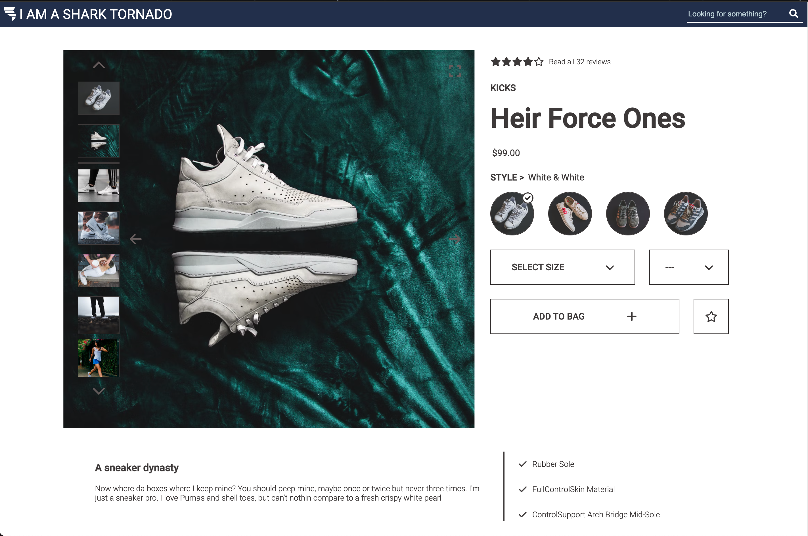
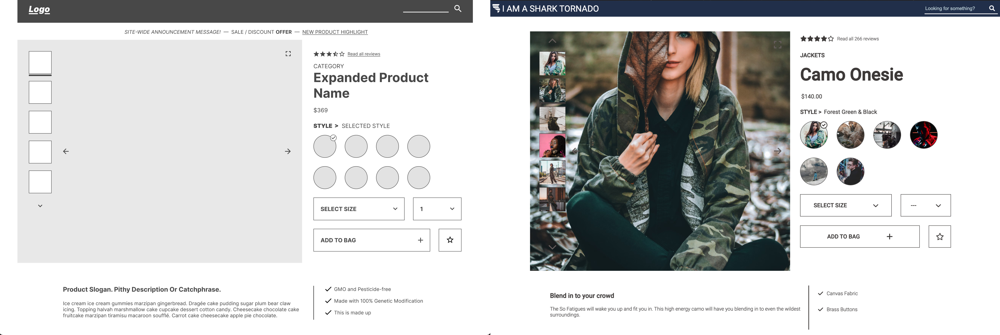

# Front End Capstone

A mock e-commerce page designed, implemented, and deployed in roughly three weeks and intended to demonstrate front-end development skills.

## Table of contents
1. [Description](#description)
2. [Screenshots](#screenshots)
3. [Installation and Startup](#installation)

## Description <a name=”description”></a>
The Front End Capstone represents roughly three weeks of planning and development toward a single product page for an e-commerce website. It was designed from a plain-language specifications document by a team of three as part of the Hack Reactor Software Engineering Immersive.

The project is divided into four main widgets: Product Overview, Related Products, Questions and Answers, and Ratings and Reviews. Each member of our team was responsible for one widget, and Related Products was a collaborative effort. The site also tracks user interaction data, including the time and target element of each click.

The **Product Overview** is the top-most widget on the page. It guides the user through different styles of products and their many images with carousels and thumbnails. The Overview also allows the user to place products into the cart for later purchase.

The **Related Products** widget displays other products to the user and allows the user to navigate to update the Product Overview with these new items. It consists of a display carousel and modals that display product comparison.

The **Questions and Answers** widget displays user-submitted questions relating to a specific product, and the answers corresponding to the individual questions. The user may search the questions, report questions and answers, and mark questions and answers as helpful.

The **Ratings and Reviews** widget displays user-created product reviews in a list format. Metadata derived from the reviews, including average rating, are displayed to the side. The reviews may be filtered by rating and sorted by newest, most relevant, and most helpful. Users have the ability to mark a review as helpful and view attached images, as well as write and post a new review.

## Screenshots <a name=”screenshots></a>




##UI Wireframe Model and Final Product


## Installation and Startup <a name=”installation”></a>
Pre-requirements:
* [Nodejs](https://nodejs.org/en/)

The project’s major dependencies include [React](https://reactjs.org/), [Express](http://expressjs.com/), [Babel](https://babeljs.io/), and [webpack](https://webpack.js.org/).

After you clone this repo to your local machine, navigate to the repo’s root directory and run these commands in the terminal:
```
npm install
npm run build
npm start
```

In order to access Hack Reactor’s server, you will need to use your own GitHub API token. Rename or copy `example.config.js` to `config.js` and edit in your GitHub token where indicated.

The webpage will be available in your browser: [http://localhost:3000](http://localhost:3000)
